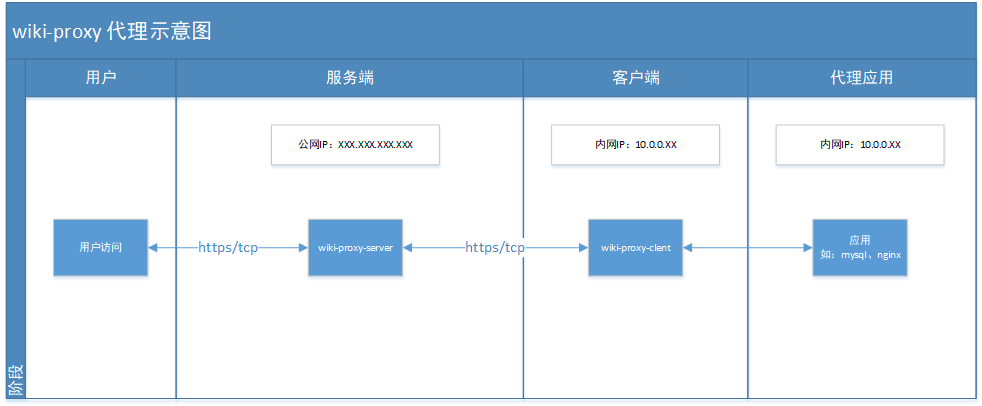

<p align="center">

</p>


<p align="center">
<font size=7>维基代理</font>
</p>

<p align="center"><font size=6>Wiki Proxy</font></p>

<p align="center">
  <a href='https://gitee.com/cdkjframework/wiki-proxy/stargazers'></img></a>
<a href='https://gitee.com/cdkjframework/wiki-proxy/members'></img></a>
<a target="_blank" href="https://www.oracle.com/java/technologies/javase/jdk17-0-13-later-archive-downloads.html">
    
</a>
<a href="./LICENSE">
    
</a>
</p>

# 1、简介

- 维基代理（wiki-proxy）、开源的java内网穿透项目。
- 技术栈：cdkjFramework（维基框架）、JPA、Netty
- 遵循MIT许可，因此您可以对它进行复制、修改、传播并用于任何个人或商业行为。
- 官网地址：https://www.framewiki.com/

# 2、项目结构

- wiki-proxy 维基代理项目
    - assets 框架资源文件
    - client 代理客户端
        - proxy-client 代理客户端项目
        - proxy-client-web 代理客户端项目
    - proxy-admin 代理监控项目（基于vue3 + element-plus开发）
    - proxy-core 代理核心库
    - proxy-util 代理工具库
    - server 代理服务端
        - proxy-server 代理服务端业务代码
        - proxy-server-web 代理服务端接口

# 3、运行

## 3.1 生成证书，使用 keytool 工具生成测试证书如下所示（建议使用Let's Encrypt生成正式证书）

``` shell
keytool -genkey -alias wiki-proxy -keyalg RSA -keysize 2048 -validity 3650 -keypass wiki-proxy@SaFePwd2025! -storepass wiki-proxy@SaFePwd2025! -keystore "./wiki-proxy.jks"
```


## 3.2 修改服务端配置文件

``` yml
spring:
  application:
    name: wiki-proxy-server
  proxy:
    server:
      # 服务端（TCP）端口
      service-port: 10010
      # 暴露端口 可以为多个
      port:
        - 443
      #  证书存放路径
      ssl-key-store-path: "D:\\Project\\wiki-proxy\\server\\proxy-server-web\\src\\main\\resources\\wiki-proxy.jks"
      # 证书密码
      ssl-key-store-password: "wiki-proxy@SaFePwd2025!"
      # 证书类型
      ssl-key-store-type: PKCS12
      # 协议 默认为 TLSv1.2 版本
      protocol: TLSv1.2
      # 算法 默认为 sunx509
      algorithm: sunx509
      # 交互密钥 AES 需要与客户端一致
      aes-key: 8AUWlb+IWD+Fhbs0xnXCCg==
      # 交互签名 key 需要与客户端一致
      token-key: tokenKey
```

## 3.3 服务端启动（Spring Boot 项目）

> com.framewiki.proxy.server.ProxyServerApplication

## 3.4 修改客户端配置文件

``` yml
spring:
  application:
    name: wiki-proxy-client
  proxy:
    client:
      # 服务端ip
      service-ip: 127.0.0.1
      # 服务端 (TCP) 端口
      service-port: 10010
      ip:
        - 127.0.0.1 # 目标代理ip
      dest-port:    # 目标代理端口
        - 50501
      port:
        - 443 # 服务端暴露端口
      #  证书存放路径
      ssl-key-store-path: "D:\\Project\\wiki-proxy\\server\\proxy-server-web\\src\\main\\resources\\wiki-proxy.jks"
      # 证书密码
      ssl-key-store-password: "wiki-proxy@SaFePwd2025!"
      # 证书类型
      ssl-key-store-type: PKCS12
      # 协议 默认为 TLSv1.2 版本
      protocol: TLSv1.2
      # 算法 默认为 sunx509
      algorithm: sunx509
      # 交互密钥 AES 需要与服务端一致
      aes-key: 8AUWlb+IWD+Fhbs0xnXCCg==
      # 交互签名 key 需要与服务端一致
      token-key: tokenKey
```

## 3.5 客户端启动（Spring Boot 项目）

> com.framewiki.proxy.client.ProxyClientApplication

# 4、部署

<p style="text-indent: 2em;">先将项目构建好jar包(构建方式如下图)、也可下载发布的jar包，然后上传至服务器指定目录下。</p>


## 4.1 部署服务端

<p style="text-indent: 2em;">先将wiki-proxy-server.jar包、Dockerfile、start.sh、stop.sh上传至服务器 /user/web/wiki-proxy/server 目录下。</p>

### 4.1.1 构建并运行Docker镜像

<p style="text-indent: 2em;">切换工作目录至/user/web/wiki-proxy/server目录下（根据自己的服务器目录结构进行修改）</p>

```shell
cd /user/web/wiki-proxy/server

```

<p style="text-indent: 2em;">执行如下命令构建Docker镜像</p>

``` shell
./start.sh

```

### 4.1.2 停止Docker镜像

```shell
./stop.sh

```

## 4.2 部署客户端

<p style="text-indent: 2em;">先将wiki-proxy-client.jar包、Dockerfile、start.sh、stop.sh上传至服务器 /user/web/wiki-proxy/client 目录下。</p>

### 4.2.1 构建并运行Docker镜像

<p style="text-indent: 2em;">切换工作目录至/user/web/wiki-proxy/client 目录下（根据自己的服务器目录结构进行修改）</p>

```shell
cd /user/web/wiki-proxy/client

```

<p style="text-indent: 2em;">执行如下命令构建Docker镜像</p>

```shell
./start.sh

```

### 4.2.2 停止Docker镜像

```shell
./stop.sh

```

# 5、代理示意图



# 6、联系我们

- 微信: wangnanfei-cn
- Gitee: https://gitee.com/cdkjframework/wiki-proxy
- Github仓库：https://github.com/cdkjframework/wiki-proxy

# 7、参与贡献

<a href="https://gitee.com/cdkjframework" target="_blank">

</a>
