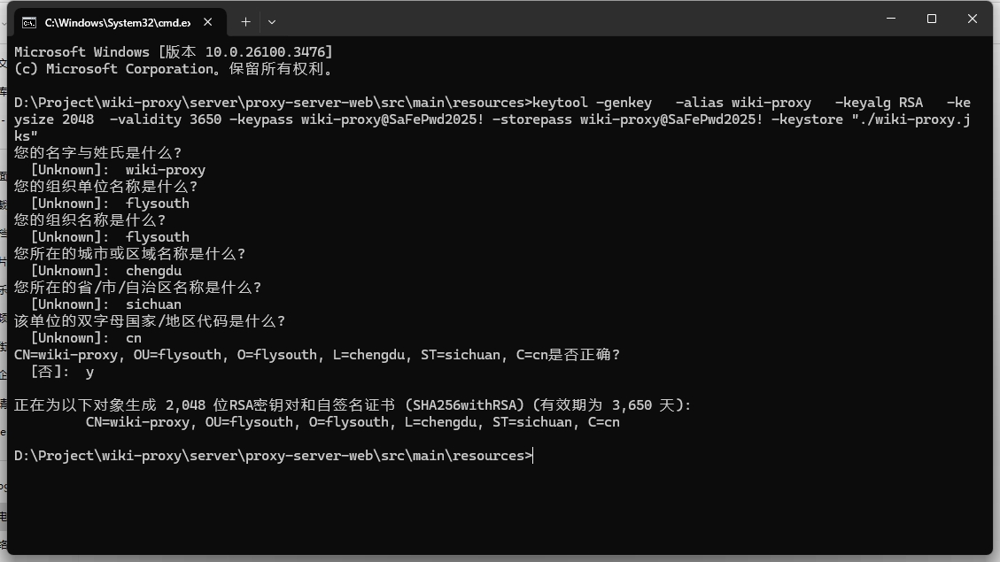
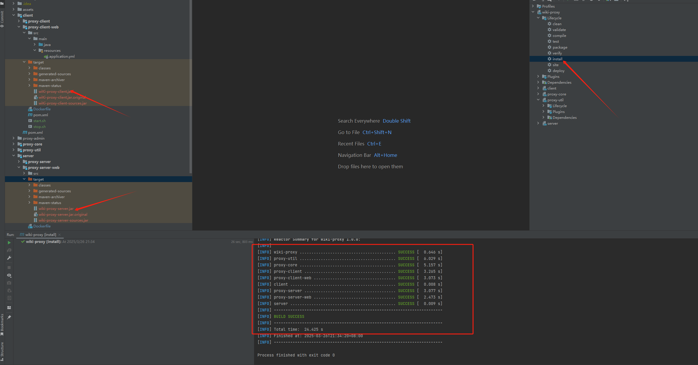
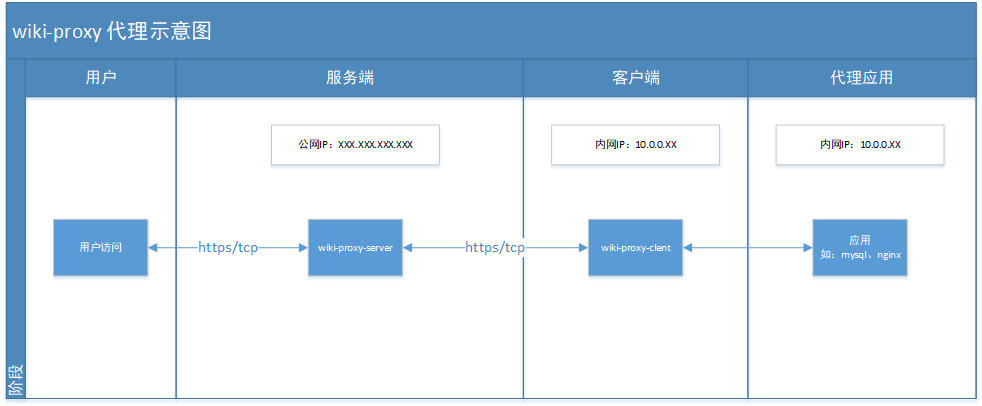

<p align="center">

</p>
<p align="center">
  <a href='https://gitee.com/cdkjframework/wiki-proxy/stargazers'></img></a>
<a href='https://gitee.com/cdkjframework/wiki-proxy/members'></img></a>
<a target="_blank" href="https://www.oracle.com/java/technologies/javase/jdk17-0-13-later-archive-downloads.html">
    
</a>
<a href="./LICENSE">
    
</a>
</p>

# 1. Introduction

- Wiki proxy, an open-source Java intranet penetration project.
- Technical stack: cdkjFramework (Wiki Framework) JPA、Netty
- Following the MIT license, you may copy, modify, distribute, and use it for any personal or commercial activity.
- Official website address: https://www.framewiki.com/

# 2. Project Structure

- wiki-proxy Wiki Proxy Project
    - assets Framework resource file
    - client Agent
        - proxy-client Proxy client project
        - proxy-client-web Proxy client interface
    - proxy-admin Proxy monitoring project (developed based on Vue3+element plus)
    - proxy-core Proxy Core Library
    - proxy-util Proxy Tool Library
    - server Proxy server
        - proxy-server Proxy server business code
        - proxy-server-web Proxy server interface

# 3. Operation

## 3.1 Generate a certificate and use the keytool tool to generate a test certificate as shown below (it is recommended to use Let's Encrypt to generate the official certificate)

``` shell
keytool -genkey -alias wiki-proxy -keyalg RSA -keysize 2048 -validity 3650 -keypass wiki-proxy@SaFePwd2025! -storepass wiki-proxy@SaFePwd2025! -keystore "./wiki-proxy.jks"
```



## 3.2 Modify the server configuration file

``` yml
spring:
  application:
    name: wiki-proxy-server
  proxy:
    server:
      # Server (TCP) port
      service-port: 10010
      # Exposed ports can be used for multiple
      port:
        - 443
      # Certificate storage path
      ssl-key-store-path: "D:\\Project\\wiki-proxy\\server\\proxy-server-web\\src\\main\\resources\\wiki-proxy.jks"
      # Certificate Password
      ssl-key-store-password: "wiki-proxy@SaFePwd2025!"
      # Certificate Type
      ssl-key-store-type: PKCS12
      # The protocol defaults to TLSv1.2 version
      protocol: TLSv1.2
      # The algorithm defaults to sunx509
      algorithm: sunx509
      # The AES interaction key needs to be consistent with the client
      aes-key: 8AUWlb+IWD+Fhbs0xnXCCg==
      # The interactive signature key needs to be consistent with the client
      token-key: tokenKey
```

## 3.3 Server Startup (Spring Boot Project)

> com.framewiki.proxy.server.ProxyServerApplication

## 3.4  Modify client configuration file

``` yml
spring:
  application:
    name: wiki-proxy-client
  proxy:
    client:
      # Server IP
      service-ip: 127.0.0.1
      # Server (TCP) port
      service-port: 10010
      ip:
        - 127.0.0.1 # Target proxy IP
      dest-port:    # Target proxy port
        - 50501
      port:
        - 443 # Server exposed port
      # Certificate storage path
      ssl-key-store-path: "D:\\Project\\wiki-proxy\\server\\proxy-server-web\\src\\main\\resources\\wiki-proxy.jks"
      # Certificate Password
      ssl-key-store-password: "wiki-proxy@SaFePwd2025!"
      # Certificate Type
      ssl-key-store-type: PKCS12
      # The protocol defaults to TLSv1.2 version
      protocol: TLSv1.2
      # The algorithm defaults to sunx509
      algorithm: sunx509
      # The AES interaction key needs to be consistent with the server
      aes-key: 8AUWlb+IWD+Fhbs0xnXCCg==
      # The interactive signature key needs to be consistent with the server
      token-key: tokenKey
```

## 3.5 Client Startup (Spring Boot Project)

> com.framewiki.proxy.client.ProxyClientApplication

# 4. Deployment

<p style="text-indent: 2em;">First, build the jar package for the project (as shown in the figure below), or download and publish the jar package, and then upload it to the designated directory on the server.</p>


## 4.1 Deploy server

<p style="text-indent: 2em;">First, upload the wiki-proxy-server. jar package, Dockerfile, start.sh, and stop.sh to the server/user/web/wiki proxy/server directory.</p>

### 4.1.1 Build and run Docker images

<p style="text-indent: 2em;">Switch the working directory to the/user/web/wiki-proxy/server directory (modify according to your own server directory structure)</p>

```shell
cd /user/web/wiki-proxy/server

```

<p style="text-indent: 2em;">Execute the following command to build a Docker image</p>

```shell
./start.sh

```

### 4.1.2 Stop Docker image

```shell
./stop.sh

```

## 4.2 Deploy client

<p style="text-indent: 2em;">First, upload the wiki-proy-client. jar package, Dockerfile, start.sh, and stop.sh to the server/user/web/wiki proxy/client directory (modify according to your own server directory structure)</p>

### 4.2.1 Build and run Docker images

<p style="text-indent: 2em;">Switch the working directory to the /user/web/wiki-proxy/client directory</p>

```shell
cd /user/web/wiki-proxy/client

```

<p style="text-indent: 2em;">Execute the following command to build a Docker image</p>

```shell
./start.sh

```

### 4.2.2 Stop Docker image

```shell
./stop.sh

```

# 5. Proxy schematic diagram



# 6. Contact us

- WeChat: wangnanfei-cn
- Gitee:  https://gitee.com/cdkjframework/wiki-proxy
- Github repository: https://github.com/cdkjframework/wiki-proxy

# 7. Participate and contribute

  <a href=" https://gitee.com/cdkjframework " target="_blank">
  
  </a>